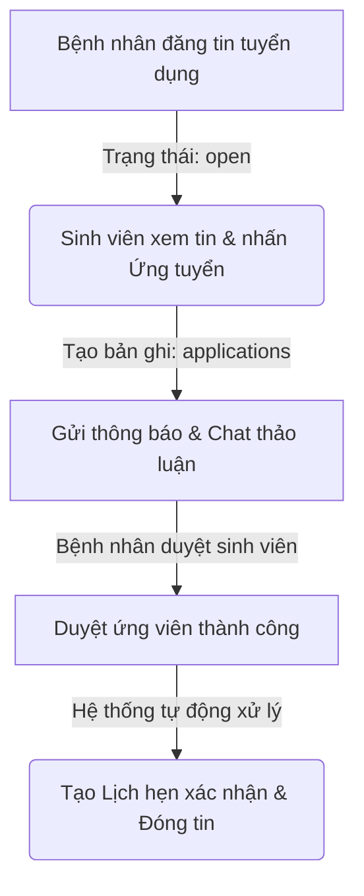

# QUY TRÌNH KẾT NỐI Y TẾ CHI TIẾT (MEDICAL CONNECTION FLOW)

Tài liệu này ghi lại toàn bộ quy trình vận hành và kỹ thuật của hệ thống **Kết nối Y tế** giữa **Bệnh nhân (hoặc Người thân)** và **Sinh viên Y khoa** trong ứng dụng của bạn.

---

## 👥 CÁC VAI TRÒ CHÍNH (ROLES)
1. **Sinh viên Y khoa (`role = 'student'`)**: Cung cấp dịch vụ chăm sóc sức khỏe, tiêm truyền, đo huyết áp, hỗ trợ phục hồi chức năng và thực hành lâm sàng.
2. **Bệnh nhân / Người thân (`role = 'patient'`)**: Cần tìm sinh viên Y khoa hỗ trợ chăm sóc sức khỏe tại nhà cho bản thân hoặc người thân.

---

## 🔄 QUY TRÌNH 5 BƯỚC KẾT NỐI CHI TIẾT



---

### 📌 BƯỚC 1: ĐĂNG TIN NHU CẦU ĐỂ TÌM KIẾM ĐỐI TÁC

#### A. Đối với Sinh viên Y khoa (Đăng tin ứng tuyển)
* **Mục đích**: Tự giới thiệu năng lực để bệnh nhân chủ động liên hệ.
* **Giao diện/Tệp tin**: [create_application.php](file:///c:/xampp/htdocs/DACN2/create_application.php)
* **Các thông tin cung cấp**:
  * Tiêu đề tin tuyển, Họ tên, Mã sinh viên, Mã lớp học.
  * Giới thiệu bản thân & kinh nghiệm lâm sàng.
  * Các kỹ năng nổi bật (đo huyết áp, tiêm truyền, chăm sóc bệnh nhân mãn tính...).
  * Chuyên khoa mong muốn hỗ trợ.
  * Thông tin liên hệ (Điện thoại/Email) và mức giá đề xuất (VNĐ/giờ).
  * **Ảnh minh chứng bắt buộc** (Ảnh thẻ sinh viên hoặc giấy tờ liên quan).

#### B. Đối với Bệnh nhân (Đăng tin tuyển dụng)
* **Mục đích**: Mô tả công việc cần thuê sinh viên hỗ trợ chăm sóc.
* **Giao diện/Tệp tin**: [create_recruitment.php](file:///c:/xampp/htdocs/DACN2/create_recruitment.php)
* **Các thông tin cung cấp**:
  * Họ tên người liên hệ, Số điện thoại/Email liên hệ.
  * Tiêu đề bài đăng, mô tả chi tiết công việc cần hỗ trợ.
  * Chuyên khoa hoặc loại hình chăm sóc cần tìm.
  * Địa chỉ/Khu vực ưu tiên thực hiện chăm sóc.
  * **Ảnh minh chứng bắt buộc** (Ảnh tình trạng sức khỏe, đơn thuốc hoặc bệnh án).
  * Video mô tả ngắn tình trạng sức khỏe (Tùy chọn).

---

### 📌 BƯỚC 2: TIẾP CẬN & NỘP HỒ SƠ ỨNG TUYỂN

* **Mục đích**: Sinh viên đề xuất nhận việc trên bài đăng của bệnh nhân.
* **Giao diện/Tệp tin**: `view_post.php` (giao diện xem chi tiết) $\rightarrow$ [apply_job.php](file:///c:/xampp/htdocs/DACN2/apply_job.php) (file xử lý ngầm)
* **Cách thức hoạt động**:
  1. Sinh viên vào trang chi tiết tin tuyển dụng của Bệnh nhân.
  2. Bấm vào nút **Ứng tuyển ngay** và nhập lời nhắn/giới thiệu ngắn.
  3. Hệ thống lưu một bản ghi mới vào bảng `applications` trong database với trạng thái mặc định là `pending` (chờ duyệt).
  4. Hệ thống tạo một **Thông báo (Notification)** đẩy thẳng về tài khoản của bệnh nhân để họ kịp thời nắm bắt thông tin.

---

### 📌 BƯỚC 3: LIÊN LẠC & TRAO ĐỔI GIỮA HAI BÊN

Trước khi chính thức quyết định hợp tác, hai bên sẽ liên hệ và trao đổi chi tiết công việc bằng **3 cách thức linh hoạt** được hỗ trợ trên hệ thống:

```
[Bệnh nhân] <==================== HỆ THỐNG KẾT NỐI ====================> [Sinh viên]
                 |                                      |
         (1) Liên hệ trực tiếp                 (2) Nhắn tin Chat nội bộ
           (Phone / Email)                     (chat.php / messages)
                 |                                      |
                 +--------------------------------------+----> (3) Gọi Video trực tuyến
                                                                (video_call.php)
```

1. **Liên hệ trực tiếp qua Hotline/Email**:
   * Hai bên có thể sử dụng trực tiếp số điện thoại hoặc email hiển thị tại phần **Thông tin liên hệ** trên bài đăng tuyển dụng/ứng tuyển để gọi điện trực tiếp hoặc gửi email bên ngoài.
2. **Nhắn tin trực tuyến (Chat nội bộ)**:
   * **Giao diện/Tệp tin**: [chat.php](file:///c:/xampp/htdocs/DACN2/chat.php), `conversations.php`, `view_messages.php`
   * Bệnh nhân và sinh viên nhắn tin trực tiếp với nhau ngay trên nền tảng web của ứng dụng, giúp thảo luận về ca trực, các dặn dò y tế và chi phí dịch vụ một cách bảo mật, lưu lại lịch sử rõ ràng.
3. **Gọi điện thoại / Gọi Video trực tiếp**:
   * **Giao diện/Tệp tin**: [video_call.php](file:///c:/xampp/htdocs/DACN2/video_call.php), `call_signaling.php`
   * Hỗ trợ cuộc gọi video trực tiếp ngay trên trình duyệt web qua công nghệ Peer-to-Peer, giúp Bệnh nhân kiểm tra trực quan thẻ sinh viên và Sinh viên nắm rõ trực quan tình trạng sức khỏe bệnh nhân trước khi tới nhà hỗ trợ.

---

### 📌 BƯỚC 4: PHÊ DUYỆT ĐỒNG Ý NHẬN VIỆC

* **Mục đích**: Bệnh nhân chốt chọn sinh viên và chính thức thiết lập kết nối y tế.
* **Giao diện/Tệp tin**: `view_post.php` (nút Duyệt ứng viên) $\rightarrow$ [accept_applicant.php](file:///c:/xampp/htdocs/DACN2/accept_applicant.php) (xử lý logic)
* **Cách thức hoạt động tự động khi bấm "Duyệt"**:
  1. **Đóng bài đăng**: Trạng thái tin tuyển dụng của bệnh nhân chuyển sang `taken` (Đã nhận việc), đồng thời gán mã sinh viên vào cột `assigned_to` để đóng tin nhận ứng tuyển.
  2. **Cập nhật đơn ứng tuyển**:
     * Đơn ứng tuyển của sinh viên được chọn chuyển sang trạng thái `accepted` (Được nhận).
     * Hệ thống tự động chuyển toàn bộ đơn ứng tuyển của các sinh viên khác trong bài đăng đó sang trạng thái `rejected` (Từ chối).
  3. **Tạo Lịch hẹn tự động**: Tạo mới một bản ghi trong bảng `appointments` với trạng thái `confirmed` (Đã xác nhận).

---

### 📌 BƯỚC 5: THIẾT LẬP LỊCH HẸN & BẮT ĐẦU CHĂM SÓC

* **Mục đích**: Sinh viên nhận việc và thực hiện theo đúng kế hoạch y tế.
* **Giao diện/Tệp tin**: [assignment_history.php](file:///c:/xampp/htdocs/DACN2/assignment_history.php) (Lịch sử nhận việc của sinh viên)
* **Quy trình vận hành sau khi duyệt**:
  * Sinh viên nhận được tin nhắn tự động từ tài khoản của bệnh nhân kèm lời chúc mừng và ghi chú chi tiết công việc.
  * Sinh viên nhận được thông báo đẩy, bấm vào thông báo để dẫn trực tiếp đến trang **Lịch sử nhận việc** (`assignment_history.php`).
  * Sinh viên theo dõi danh sách lịch hẹn chăm sóc sức khỏe đã được xác nhận (mã lịch hẹn, tên bệnh nhân, thời gian bắt đầu chăm sóc, các lưu ý đặc biệt) để chuẩn bị dụng cụ y tế và đến nhà bệnh nhân thực hiện dịch vụ chăm sóc.
